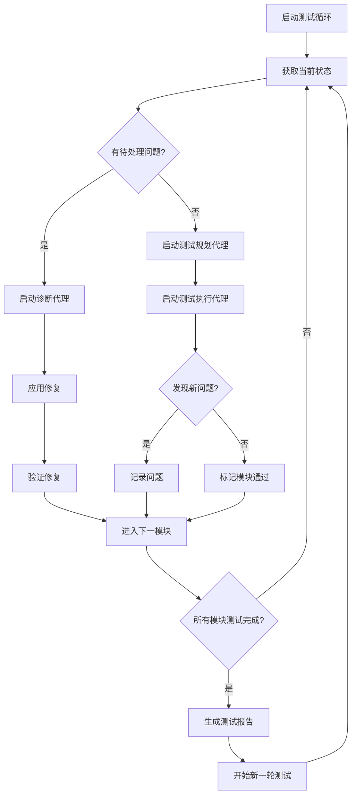

# XinMallAgent 持续测试循环

## 测试循环控制

这是主控脚本，用于协调自动化测试循环。

### 循环结构



### 模块测试顺序

每轮测试按以下顺序覆盖各模块：

1. **首页模块** (10分钟)
   - 搜索功能
   - 分类导航
   - Banner轮播
   - 商品列表加载

2. **商品模块** (15分钟)
   - 商品详情
   - 规格选择
   - 收藏功能
   - 分享功能

3. **购物车模块** (10分钟)
   - 添加商品
   - 修改数量
   - 删除商品
   - 价格计算

4. **订单模块** (20分钟)
   - 创建订单
   - 地址选择
   - 支付流程
   - 订单状态

5. **用户中心模块** (15分钟)
   - 个人信息
   - 收货地址
   - 订单列表
   - 收藏列表

6. **社区模块** (10分钟)
   - 帖子浏览
   - 发布帖子
   - 点赞评论

7. **消息模块** (5分钟)
   - 消息列表
   - 未读状态

### 问题优先级定义

| 级别 | 定义 | 处理时间 |
|------|------|----------|
| P0-Critical | 核心功能完全无法使用 | 立即处理 |
| P1-Major | 主要功能受影响 | 30分钟内 |
| P2-Minor | 次要功能问题 | 当轮测试结束后 |
| P3-Enhancement | 优化建议 | 下一版本 |

### 自动修复规则

1. **价格显示问题**: 检查是否有 `/100` 或 `*100` 的错误转换
2. **状态映射问题**: 检查前后端状态枚举是否一致
3. **数据绑定问题**: 检查变量名是否正确绑定
4. **API响应问题**: 检查字段名是否与后端返回匹配
5. **导航问题**: 检查路由配置是否正确

### 测试记录格式

每次测试循环生成一个记录文件：

```json
{
  "roundId": "ROUND-YYYYMMDD-HHMMSS",
  "startTime": "ISO时间戳",
  "endTime": "ISO时间戳",
  "duration": "持续时间(分钟)",
  "modulesTested": ["模块列表"],
  "issuesFound": [
    {
      "issueId": "ISSUE-XXX",
      "severity": "P0/P1/P2/P3",
      "description": "问题描述",
      "status": "fixed/open"
    }
  ],
  "passRate": "通过率百分比",
  "summary": "测试总结"
}
```

## 当前状态

- 状态: 初始化中
- 当前轮次: 1
- 启动时间: 待记录
